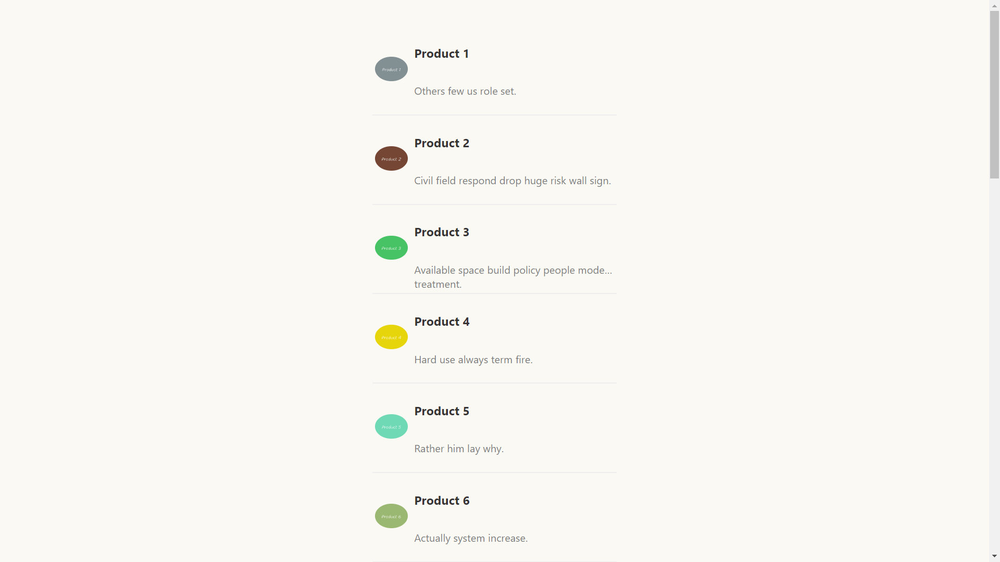
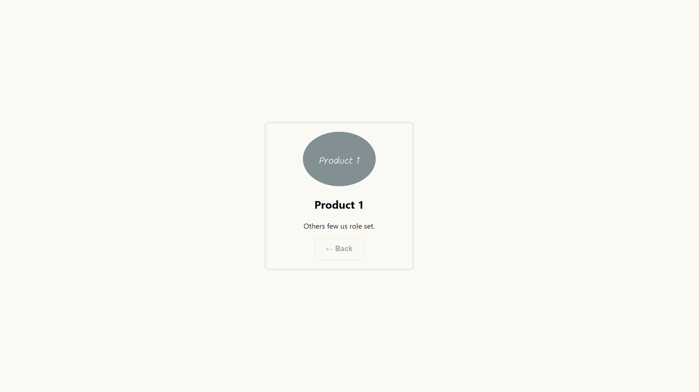

# React Product Catalog App

This is a simple React application that allows users to see a list  of products and view details about individual products. It utilizes React Router for navigation and fetches product data from an external API.

The data is fetched from https://www.slingacademy.com/

## Table of Contents

- [Features](#features)
- [Installation](#installation)
- [Usage](#usage)
- [Folder Structure](#folder-structure)
- [Screenshots](#Screenshots)


## Features

- View a list of products.
- Click on a product to view its details.
- Navigate back to the product list from the product details page.
- Infinite scrolling to load more products as you scroll down.

## Installation

 Clone the repository to your local machine:
```bash
git clone https://github.com/your-username/react-product-catalog.git

cd react-product-catalog
```

## Usage

    npm start
    # or
    yarn start
Open your web browser and navigate to http://localhost:3000 to use the application.

## Folder Structure
*  src/ - Contains the application source code.
* components/ - React components used in the application.
* pages/ - Page-level components.
* styles.module.css - CSS modules for styling.
* public/ - Public assets.

## Screenshots



